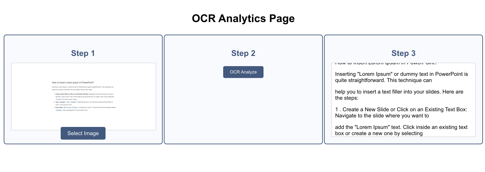

# OCR Analytics Page – 3-Step Image Text Extraction Tool

This web application lets users upload an image, analyze it using Azure's Computer Vision OCR API, and view the extracted text in a clean, categorized output format.

Built using:
- **React.js** (Frontend)
- **FastAPI** (Backend)
- **Azure Computer Vision** (OCR API)

---

## Features

- Step 1: Upload an image for OCR
- Step 2: Trigger analysis via a clean button interface
- Step 3: View categorized OCR text results
- Azure `.env` configuration
- Easy to test and deploy locally

---

## How to Run

### Backend (FastAPI + Azure OCR)

```bash
cd backend
python3 -m venv venv
source venv/bin/activate
pip install -r requirements.txt

# Create a .env file with your Azure credentials:
# AZURE_ENDPOINT=https://<your-endpoint>
# AZURE_KEY=<your-key>

python3 -m uvicorn main:app --reload

```


### Frontend 

cd frontend/my-app
npm install
npm start


### .env Setup

AZURE_ENDPOINT=https://your-resource-name.cognitiveservices.azure.com
AZURE_KEY=your_azure_subscription_key


## Learning Outcome

Integration of AI/ML APIs into web platforms

Frontend-backend interaction using REST APIs

Clean 3-step UI workflows for technical tools


